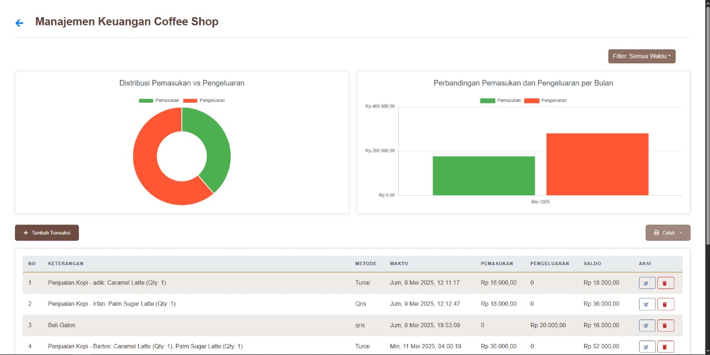

# 🚀 Laporan Progres Mingguan - **SmartBizAdmin**

## 👥 Kelompok: 5
- **Muhammad Fikri Haikal Ariadma / 10231063**  
- **Irfan Zaki Riyanto / 10230145** 
- **Micka Mayulia Utama / 10231053**  
- **Ika Agustin Wulandari / 10231041**  
  
## 🤝 Mitra: Kost Al-Fitri D’Carjoe  
## 📅 Pekan ke-: 14  
## 🗓️ Tanggal:  16/05/2025
 
## ✨ Progress Summary
Pada pekan ke-14, tim **SmartBizAdmin** berhasil mengidentifikasi dan memperbaiki sejumlah bug krusial, serta menyelesaikan siklus pertama pengujian kegunaan untuk mengumpulkan umpan balik pengguna terkait antarmuka dan alur kerja sistem.

---

## ✅ Accomplished Tasks
- 🐛 Menyelesaikan perbaikan bug tampilan pada halaman **Manajemen Inventaris**.
- 🎯 Melakukan sesi pengujian kegunaan dengan 2 partisipan untuk alur autentikasi dan dashboard.
- 🎯 Menganalisis data awal dari pengujian kegunaan modul manajemen coffee shop.
- ✨ Melakukan polishing pada elemen UI di seluruh halaman

---

## 🐛 Bugfixing

### **Identifikasi Bug**
Kami mengidentifikasi bug dalam sistem melalui beberapa cara, yaitu:
- **Pengujian internal** yang saya lakukan sendiri saat mengembangkan dan melakukan refactoring fitur.
- **Laporan dari pengguna** selama sesi usability testing, ada laporan mengenai tampilan card inventaris yang tumpang tindih atau tema yang tidak berubah.
- **Pesan error di konsol** serta error yang muncul saat proses build atau saat aplikasi dijalankan, seperti error sintaks pada file JSX atau pesan “Tanggal tidak valid” pada kolom waktu transaksi.

Contoh bug spesifik yang saya temukan:
- Tampilan card inventaris menumpuk dan ukuran card berubah-ubah.
- Tema terang/gelap tidak konsisten pada halaman inventaris.
- Tanggal transaksi menampilkan “Tanggal tidak valid” pada halaman keuangan.
- Error sintaks JSX yang menyebabkan halaman tidak bisa dirender.

---

### **Analisis dan Reproduksi Bug**
Untuk memahami akar penyebab bug, saya mereproduksi bug dengan menjalankan aplikasi di lingkungan pengembangan (localhost) dan mengikuti langkah-langkah yang dilaporkan pengguna atau yang saya temukan sendiri saat pengujian internal.  
- Untuk bug tampilan, saya melakukan resize window dan mengganti tema untuk melihat responsivitas serta konsistensi UI.
- Untuk bug tanggal, Kami mencoba input transaksi baru dan memeriksa hasil render pada kolom waktu.
- Error sintaks Kami cek melalui pesan error yang muncul di terminal/console dan editor.

---

### **Perbaikan Bug**
Langkah-langkah yang Kami lakukan untuk memperbaiki bug antara lain:
- **Tampilan Card:** Saya memperbaiki CSS pada file `ManageInventarisKost.css` dan `ManageInventarisCoffeeShop.css` agar card memiliki ukuran tetap dan margin antar card menjadi rapi.
- **Tema:** Saya menambahkan dan memperbaiki class tema (`theme-light` dan `theme-dark`) pada container utama di file JSX dan CSS agar perubahan tema konsisten di seluruh halaman.
- **Tanggal Tidak Valid:** Saya memperbaiki logika parsing dan formatting tanggal pada file `ManageCoffeeShopFinance.jsx` agar menggunakan format yang sesuai dan menangani data kosong/null dengan baik.
- **Error Sintaks JSX:** Saya memperbaiki penulisan JSX yang kurang tanda kurung atau penutup pada file seperti `ManageInventarisCoffeeShop.jsx`.
- **Validasi Form:** Saya menambahkan validasi pada form input agar data yang masuk valid dan error bisa ditangani dengan baik.

---

### **Pengujian Perbaikan**
Setelah melakukan perbaikan, kami melakukan **pengujian manual** dengan menjalankan aplikasi dan mencoba semua fitur yang terkait dengan bug yang sudah diperbaiki.  
Kami juga melakukan **pengujian regresi** untuk memastikan bahwa perbaikan yang dilakukan tidak menimbulkan bug baru di fitur lain.  
Beberapa bagian juga saya uji kembali melalui **usability testing** bersama pengguna untuk memastikan bug tidak muncul lagi dan pengalaman pengguna menjadi lebih baik.

---

### **Hasil**
- Total ada **6 bug utama** yang kami temukan selama siklus ini.
- **Semua bug berhasil saya perbaiki** dan sudah diverifikasi tidak muncul lagi.
- Tidak ada bug kritis yang tersisa, namun saya tetap melakukan monitoring untuk bug minor yang mungkin muncul pada pengembangan berikutnya.

---

## 🎯 Usability Testing

### **Perencanaan Pengujian Kegunaan**
Kami melakukan pengujian kegunaan dengan tujuan utama untuk mengevaluasi kemudahan penggunaan sistem, khususnya pada alur login, navigasi dashboard, dan manajemen inventaris (kost & coffee shop). Skenario pengujian yang digunakan meliputi:
- Login ke sistem menggunakan akun yang sudah terdaftar.
- Navigasi ke halaman dashboard dan memahami informasi yang ditampilkan.
- Mengakses halaman manajemen inventaris, menambah, mengedit, dan menghapus data inventaris.
- Mengganti tema terang/gelap.
- Logout dari sistem.

Pengujian ini melibatkan 2 partisipan yang merupakan pengguna potensial dari sistem, yaitu pengelola kost dan staff coffee shop.

---

### **Pelaksanaan Pengujian**
Pengujian dilakukan secara langsung (in-person) di lingkungan Area Kos Client menggunakan laptop dengan browser Chrome. Kami memberikan instruksi tertulis dan observasi langsung saat partisipan mencoba setiap skenario. Selain itu, saya juga mencatat waktu penyelesaian tugas dan reaksi pengguna terhadap tampilan serta fitur sistem.

---

### **Temuan Pengujian**
Beberapa temuan utama dari usability testing:
- **Navigasi:** Sebagian besar partisipan dapat berpindah antar halaman dengan mudah, namun ada kebingungan pada ikon-ikon tertentu yang belum diberi label tooltip.
- **Tampilan Card Inventaris:** Partisipan melaporkan bahwa card inventaris pada awalnya menumpuk dan ukurannya tidak konsisten, sehingga membingungkan saat melihat banyak data.
- **Tema:** Ada keluhan bahwa perubahan tema tidak langsung diterapkan di seluruh halaman, terutama pada halaman inventaris.
- **Validasi Form:** Beberapa partisipan sempat mengisi form dengan data yang tidak valid (misal: stok kosong), namun sistem belum memberikan pesan error yang jelas.
- **Logout:** Tombol logout mudah ditemukan dan berfungsi dengan baik.

---

### **Rekomendasi Perbaikan**
Berdasarkan temuan tersebut, kami merekomendasikan beberapa perbaikan:
- Menambahkan tooltip pada ikon-ikon aksi agar pengguna lebih paham fungsinya.
- Memperbaiki CSS card inventaris agar ukuran dan margin antar card konsisten.
- Memastikan perubahan tema langsung diterapkan ke seluruh halaman dengan memperbaiki class tema pada container utama.
- Menambahkan validasi dan pesan error yang jelas pada form input.
- Melakukan polishing pada elemen UI agar tampilan lebih rapi dan profesional.

---

### **Rencana Tindak Lanjut**
Semua rekomendasi di atas sudah mulai kami integrasikan ke dalam proses pengembangan berikutnya. Perbaikan pada tampilan card dan tema sudah diterapkan pada minggu ini, dan penambahan tooltip dan validasi form juga sudah kami implementasikan pada sistem. kami juga akan melakukan usability testing lanjutan setelah perbaikan untuk memastikan pengalaman pengguna semakin baik.

---

## ⚠️ Challenges & 💡 Solutions

- **🔍 Challenge 1: Konsistensi Tampilan Card Inventaris**  
  Pada awalnya, card inventaris sering menumpuk dan ukurannya berubah-ubah, terutama saat data banyak atau gambar berbeda ukuran. Hal ini membuat tampilan menjadi kurang rapi dan membingungkan pengguna.  
  **✅ Solution:** Saya memperbaiki CSS pada file `ManageInventarisKost.css` dan `ManageInventarisCoffeeShop.css` agar setiap card memiliki ukuran tetap dan margin antar card konsisten, sehingga tampilan menjadi lebih rapi dan mudah dibaca.

- **📌 Challenge 2: Tema Tidak Konsisten di Seluruh Halaman**  
  Saat pengguna mengganti tema terang/gelap, tidak semua halaman langsung mengikuti perubahan tema, khususnya pada halaman inventaris.  
  **✅ Solution:** Saya menambahkan dan memperbaiki class tema (`theme-light` dan `theme-dark`) pada container utama di setiap halaman serta memastikan CSS sudah mengatur warna latar dan teks sesuai tema yang dipilih.

- **⚠️ Challenge 3: Validasi dan Feedback Form Kurang Jelas**  
  Beberapa pengguna mengisi form dengan data yang tidak valid (misal: stok kosong atau tanggal tidak diisi), namun sistem belum memberikan pesan error yang jelas sehingga membingungkan pengguna.  
  **✅ Solution:** Saya menambahkan validasi pada form input dan memberikan pesan error yang jelas jika data tidak valid, sehingga pengguna dapat mengetahui kesalahan input sebelum data dikirim ke server.

---

## 📅 Next Week Plan  
- 🗺️ Menyiapkan dan melakukan presentasi final sistem kepada mitra dan dosen pembimbing.
- 🛠️ Melengkapi seluruh dokumentasi proyek, termasuk README, dokumentasi API, dan user manual agar mudah dipahami oleh pengguna maupun pengembang selanjutnya.
- 🔌 Melakukan penyerahan kode sumber (source code) beserta proses deployment aplikasi ke server/hosting yang telah disepakati.
- 📽️ Melakukan evaluasi akhir proyek bersama tim, mendokumentasikan lessons learned, serta menyusun laporan refleksi untuk pengembangan di masa mendatang.

---

## 👨‍💻 Contributions  

- **🧑‍🎨 Muhammad Fikri Haikal Ariadma / 10231063**  
  →  
  - Merancang dan mengimplementasikan struktur database serta backend API utama.
  - Mengembangkan sebagian besar fitur frontend menggunakan React (dashboard, manajemen inventaris, keuangan, menu coffee shop, dsb).
  - Menangani integrasi antara frontend dan backend (API call, autentikasi, dsb).
  - Melakukan pengujian internal, usability testing, serta memperbaiki bug yang ditemukan.
  - Mengimplementasikan fitur tema terang/gelap dan memastikan konsistensi UI di seluruh halaman.
  - Membuat dokumentasi proyek (README, API docs, user manual).
  - Berkoordinasi dengan tim dan mitra dalam proses pengembangan dan presentasi sistem.
  - Membuat Laporan

- **🧑‍💻 Irfan Zaki Riyanto / 10230145**  
  → -

- **👩‍🎨 Micka Mayulia Utama / 10231053**  
  → -

- **👩‍💼 Ika Agustin Wulandari / 10231041**  
  → -

---

## 🖼️ Screenshots / Demo Website

### 📸 Halaman Login

Tampilan halaman login sistem **SmartBizAdmin**. Pengguna dapat masuk menggunakan akun yang telah terdaftar. Terdapat validasi input dan feedback jika data tidak sesuai.

---

### 📸 Halaman Register

Form registrasi untuk pembuatan akun baru. Pengguna wajib mengisi data dengan benar sebelum dapat mengakses sistem, dan di halaman login register ini form menggunakan wrapper slider untuk GIF pada backgroundnya

---

### 📸 Dashboard (Tema Terang)

Tampilan dashboard utama dalam mode terang, menampilkan ringkasan statistik dan menu navigasi utama.

---

### 📸 Dashboard (Tema Gelap)

Dashboard utama dalam mode gelap. Pengguna dapat mengganti tema sesuai preferensi untuk kenyamanan visual.

---

### 📸 Manajemen Inventaris

Halaman **Manajemen Inventaris** menampilkan daftar seluruh barang inventaris kost dalam bentuk card yang rapi, konsisten, dan responsif.  
Setiap card berisi informasi penting seperti nama barang, stok saat ini, minimum stok, tanggal kadaluarsa (jika ada), serta tombol aksi untuk mengedit atau menghapus data.  
Pada tampilan ini, pengguna dapat dengan mudah menambah, mengedit, atau menghapus item inventaris melalui tombol aksi yang tersedia.  
Perbaikan pada tampilan card memastikan ukuran dan jarak antar card seragam, sehingga data mudah dibaca dan tidak tumpang tindih, meskipun jumlah data banyak atau gambar barang berbeda ukuran.  
Fitur pencarian dan filter juga tersedia untuk memudahkan pengguna menemukan barang tertentu dalam daftar inventaris.

---

### 📸 Manajemen Menu Coffee Shop

Halaman **Manajemen Menu Coffee Shop** menampilkan daftar menu yang tersedia di coffee shop dalam bentuk card yang rapi dan mudah dibaca.  
Super admin dapat menambah, mengedit, dan menghapus item menu melalui tombol aksi yang tersedia pada setiap card.  
Setiap menu dilengkapi dengan informasi seperti nama, harga, kategori, dan gambar produk.  
Fitur filter juga memudahkan pengguna dalam menemukan menu tertentu.

---

### 📸 Manajemen Kamar Kost

Halaman **Manajemen Kamar Kost** digunakan untuk mengelola data kamar kost, termasuk status ketersediaan kamar, detail kamar, data penghuni, serta riwayat pembayaran bulanan.  
Tampilan tabel dan detail kamar memudahkan admin dalam memantau dan mengelola seluruh kamar yang tersedia di kost.

---

### 📸 Manajemen Keuangan Coffee Shop

Halaman **Manajemen Keuangan Coffee Shop** menampilkan pengelolaan transaksi keuangan, baik pemasukan maupun pengeluaran.  
Data keuangan divisualisasikan menggunakan grafik diagram batang dan diagram donat untuk memudahkan analisis.  
Terdapat fitur pendukung seperti filter waktu dan opsi cetak data keuangan dalam bentuk softfile, sehingga laporan keuangan dapat diakses dan didokumentasikan dengan mudah.

---

### 📸 Manajemen Keuangan Kost

Halaman pengelolaan keuangan untuk bisnis kost, menampilkan riwayat transaksi dan laporan keuangan, secara keseluruhan Fitur sama saja dengan Manajemen keuangan Coffe Shop

---

### 📸 Manajemen User

Halaman **Manajemen User** digunakan untuk mengelola data seluruh pengguna sistem, baik superadmin maupun admin.  
Pada halaman ini, admin dapat melihat daftar user, menambah user baru, mengedit data user, serta menghapus user yang tidak aktif.  
Tampilan tabel user dirancang agar mudah dibaca dan setiap aksi dilengkapi tombol yang jelas untuk memudahkan pengelolaan data pengguna.

---

### 📸 Modal Konfirmasi

Contoh tampilan **modal konfirmasi** yang muncul saat pengguna akan menghapus data penting, seperti data inventaris atau user.  
Fitur ini berfungsi untuk mencegah penghapusan data secara tidak sengaja, dengan meminta konfirmasi ulang sebelum aksi dilakukan.

---

### 📸 Modal Tambah Data

Tampilan **modal tambah data** yang digunakan untuk menambah data baru ke sistem, baik itu data inventaris, menu, atau user.  
Modal ini dilengkapi dengan validasi input, sehingga data yang masuk ke sistem sudah dipastikan valid dan sesuai format yang diharapkan.

---
---

## 🌟 Penutup & Penyemangat

Setiap langkah kecil yang kita lakukan hari ini adalah pondasi untuk kesuksesan di masa depan. Jangan ragu untuk terus belajar, mencoba, dan memperbaiki diri. Semangat untuk hari ini—kerja kerasmu akan membuahkan hasil yang luar biasa! 🚀💪

Tetap percaya pada proses, jangan takut gagal, dan teruslah melangkah maju. Bersama, kita pasti bisa mencapai tujuan yang diimpikan!

---