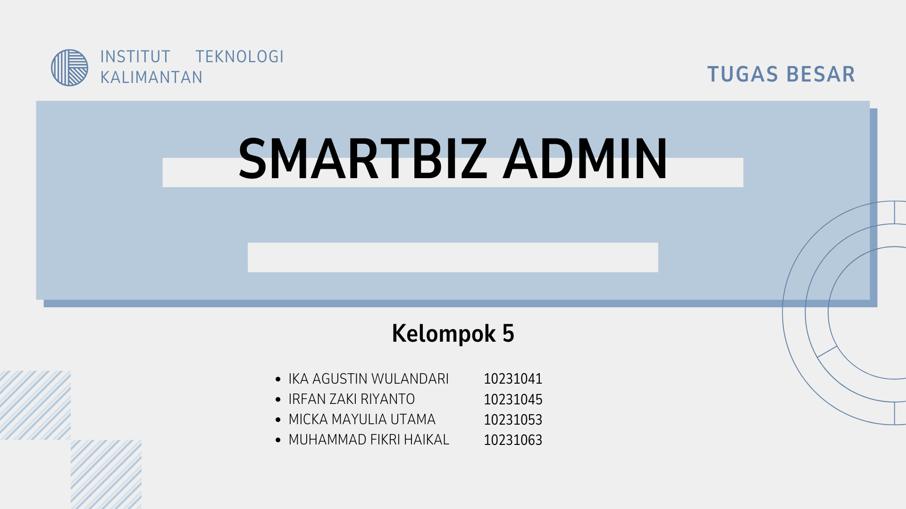
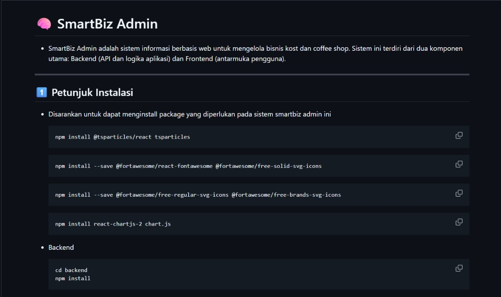
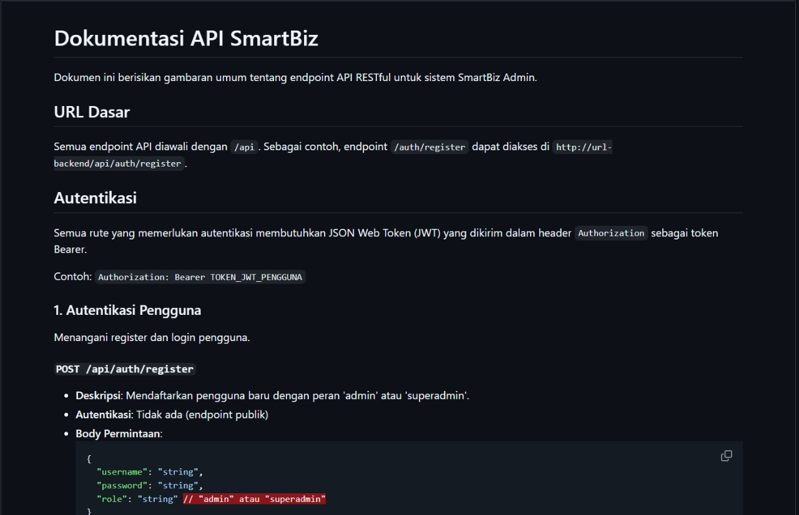
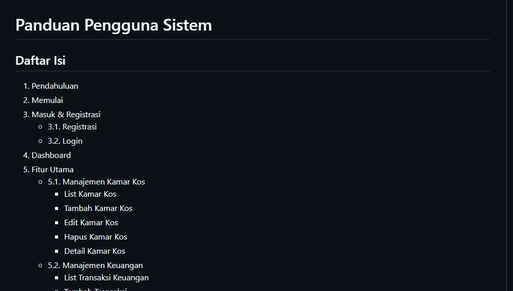

# 🚀 Laporan Progres Mingguan - **SmartBizAdmin**

## 👥 Kelompok: 5
- **Muhammad Fikri Haikal Ariadma / 10231063**  
- **Irfan Zaki Riyanto / 10231045** 
- **Micka Mayulia Utama / 10231053**  
- **Ika Agustin Wulandari / 10231041**  
---
## 🤝 Mitra: Kost Al-Fitri D’Carjoe
## 📅 Pekan ke-: 15
## 🗓️ Tanggal:  23/05/2025

## ✨ Progress Summary  
- Pada pekan ke-15, tim **SmartBizAdmin** telah menyelesaikan sejumlah tugas akhir proyek, yaitu presentasi final kepada mitra sebagai bentuk pelaporan hasil dan demo sistem, penyusunan dokumentasi lengkap yang mencakup README, dokumentasi API, dan panduan pengguna, penyerahan kode sumber beserta proses deployment agar sistem siap digunakan, serta evaluasi proyek dan perumusan lessons learned sebagai refleksi dan bahan perbaikan untuk proyek selanjutnya.

---

## ✅ Accomplished Tasks  
|Tugas|Keterangan|
|---|---|
|🗂️ Presentasi final ke mitra|✅|
|🧩 Dokumentasi lengkap (README, API docs, user manual)|✅|
|🗃️ Penyerahan kode sumber dan deployment|❌|
|🔌 Evaluasi proyek dan lessons learned|✅|
---

## 📅 Next Week Plan  
- 🗺️ Persiapan presentasi
- 🛠️ Deployment
- 📽️ Presentasi
---

## 👨‍💻 Contributions  
|Nama/NIM|Kontribusi|
|---|---|
|🧑‍🎨 Muhammad Fikri Haikal Ariadma / 10231063|Membuat dokumentasi `User Manual`|
|🧑‍💻 Irfan Zaki Riyanto / 10230145|Membuat dokumentasi `API docs`|
|👩‍🎨 Micka Mayulia Utama / 10231053|Membuat dokumentasi `README.md`, Membuat laporan week 15|
|👩‍💼 Ika Agustin Wulandari / 10231041|Membuat dookumentasi `README.md`, Membuat laporan week 15|
---
## 🖼️ Screenshots / Demo  
- ### 📎 **Final Presentation:**  
    - **Slide**
       - [Link Slide](https://www.canva.com/design/DAGoPcBiwOs/twrWERNSEhvFxOZfDh8DTA/edit)  
         

- ### 📎 **Completed Documentation:**  
    - **Readme.md**
    
    SmartBiz Admin adalah sistem berbasis web yang dirancang untuk mempermudah pengelolaan pemesanan kamar kos, stok barang, dan laporan keuangan secara real-time pada Kost Al Fitri De Carjoe dan Kedai Kopi Area Sembilan guna meningkatkan efisiensi operasional dan kenyamanan pengguna.

        
        Fitur Utama
        - 5.1 Manajemen Kamar Kos
            - List Kamar Kos
            - Tambah Kamar Kos
            - Edit Kamar Kos
            - Hapus Kamar Kos
            - Detail Kamar Kos
        
        - 5.2 Manajemen Keuangan
            - List Transaksi Keuangan
            - Tambah Transaksi
            - Edit Transaksi 
            - Hapus Transaksi
            - Grafik Keuangan
            - Filter & Pencarian

        - 5.3 Manajemen Coffee Shop Menu
            - List Menu
            - Tambah Menu
            - Edit Menu
            - Hapus Menu
            - Detail Menu
            - Filter
        
        - 5.4 Manajemen User
            - List User
            - Tambah User
            - Edit User
            - Hapus User 
            - Detail User

        - 5.5 Manajemen Inventaris
            - List Inventaris 
            - Tambah Inventaris
            - Edit Inventaris
            - Hapus Inventaris
            - Detail Inventaris


        Teknologi
        - Frontend : React, Bootstrap, HTML
        - Backend :  Express.JS
        - Database : PostgreSQL
        


    - **API docs**
    
    API docs menjelaskan bagaimana sistem backend SmartBiz Admin menyediakan data dan layanan melalui endpoint API.
        
        Base URL
        /api

        Autentifikasi
        Api menggunakan sistem autentifikasi JSON Web Token (JWT)

        Endpoint

        Menu
        - GET /coffee-shop/menus – Ambil semua menu
        - GET /coffee-shop/menus/:id – Detail menu
        - POST /coffee-shop/menus – Tambah menu (Superadmin)
        - PUT /coffee-shop/menus/:id – Edit menu (Superadmin)
        - DELETE /coffee-shop/menus/:id – Hapus menu (Superadmin)

        Inventaris
        - GET /inventaris – Daftar inventaris
        - POST /inventaris – Tambah item (Superadmin)
        - PUT /inventaris/:id – Update item (Superadmin)
        - DELETE /inventaris/:id – Hapus item (Superadmin)

        Pesanan (Coffee Shop)
        - POST /coffee-shop/orders – Buat pesanan
        - GET /coffee-shop/orders – Daftar semua pesanan
        - GET /coffee-shop/orders/:id – Detail pesanan
        - GET /coffee-shop/orders/:id/receipt – Cetak resi pesanan

        Keuangan
        - GET /keuangan/detail – Daftar transaksi
        - POST /keuangan/detail – Tambah transaksi
        - PUT /keuangan/detail/:id – Update transaksi
        - DELETE /keuangan/detail/:id – Hapus transaksi

        Kamar Kos
        - GET /kos – Daftar kamar kos
        - GET /kos/:id – Detail kamar
        - POST /kos – Tambah kamar (Superadmin)
        - PUT /kos/:id – Update kamar (Superadmin)
        - DELETE /kos/:id – Hapus kamar (Superadmin)

        Pembayaran Kos
        - GET /kos/:roomId/payment-history – Riwayat pembayaran kamar
        - POST /kos/pembayaran – Tambah pembayaran kos (dengan bukti)
        - PUT /kos/pembayaran/:paymentId/status – Update status pembayaran kos

        - Penting untuk frontend developer atau pihak ketiga agar bisa berinteraksi dengan sistem secara benar.

        - Bisa dibuat menggunakan Swagger, Postman, atau ditulis manual dalam markdown. 


    - **User Manual**
    
   
    Panduan Pelanggan 

    1. Registrasi dan Login
        - Klik Register di halaman utama
        - Isi formulir (username & password)
        - Jika valid, akun akan dibuat dan langsung bisa login
        - Login menggunakan username & password

    2. Dashboard
        - Menampilkan ringkasan data (statistik & grafik)
        - Navigasi ke fitur utama

    3. Manajemen Kamar Kos
        - List : lihat semua kamar kod
        - Tambah : Buat Kamar baru
        - Edit : Ubah detail kamar
        - Hapus : Hapus kamar
        - Detail : Lihat fasilitas, histori penyewaan.

    4. Manajemen Keuangan
        -  List: Lihat semua transaksi pemasukan/pengeluaran.
        - Tambah: Tambah transaksi baru.
        - Edit: Ubah data transaksi.
        - Hapus: Hapus transaksi (dengan konfirmasi).
        - Grafik: Visualisasi grafik keuangan.
        - Filter & Search: Filter transaksi berdasarkan kategori, tanggal, nominal.

    Panduan Admin

    1. Login Admin
        - Akses /admin
        - Masuk dengan username & password yang valid

    2. Manajemen Menu (Coffee Shop)
        -  List: Daftar menu (nama, harga, stok, kategori)
        - Tambah: Tambah menu baru
        - Edit: Ubah detail menu
        - Hapus: Hapus menu
        - Detail & Filter: Lihat deskripsi & filter berdasarkan kategori
    
    3. Manajemen User
        - List: Daftar user (username, role)
        - Tambah/Edit/Hapus: Kelola user (khusus Superadmin)
        - Detail: Lihat data user
    
    4. Manajemen Inventaris
        - List: Daftar barang (gambar, nama, jumlah, kondisi)
        - Tambah: Tambah item baru
        - Edit: Ubah data inventaris
        - Hapus: Hapus item
        - Detail: Lihat informasi lengkap inventaris

    Panduan Superadmin

    1. Login Superadmin
        - Akses /superadmin
        - Login menggunakan kredensial superadmin
    
    2. Akses Fitur Lengkap
        - Semua fitur admin, ditambah fitur berikut : 
    
    3. Manajemen User
        - Tambah/Edit/Hapus admin
        - Atur role (admin/superadmin)

    4. Manajemen Sistem
        - Konfigurasi sistem (pembayaran, backup)
        - Monitoring performa
        - Lihat log sistem & error
        - Statistik pengunjung & laporan


- ### 📎 **Source Code:**  
```
Final/
├── backend/
│   ├── config/
│   │   └── db.js
│   ├── controllers/
│   │   ├── coffeeShopController.js
│   │   ├── InventarisController.js
│   │   ├── keuanganController.js
│   │   └── kosController.js
│   ├── middleware/
│   │   ├── authMiddleware.js
│   │   └── roleMiddleware.js
│   ├── routes/
│   │   ├── auth.js
│   │   ├── coffeeShop.js
│   │   ├── inventaris.js
│   │   ├── InventarisRoutes.js
│   │   ├── keuangan.js
│   │   ├── kos.js
│   │   └── UserRoutes.js
│   ├── uploads/
│   │   ├── bukti_pembayaran_kos/
│   │   └── inventaris/
│   └── node_modules/
│
├── frontend-app/
│   ├── public/
│   │   ├── index.html
│   │   └── vite.svg
│   ├── src/
│   │   ├── assets/
│   │   ├── components/
│   │   ├── App.css
│   │   ├── App.jsx
│   │   ├── index.css
│   │   └── main.jsx
│   ├── .gitignore
│   ├── eslint.config.js
│   ├── index.html   ← kemungkinan duplikat, utamanya di `public/`
│   ├── package.json
│   ├── package-lock.json
│   ├── README.md
│   ├── vite.config.js
│   └── node_modules/
│
└── README.md (opsional untuk root proyek)
```
---
