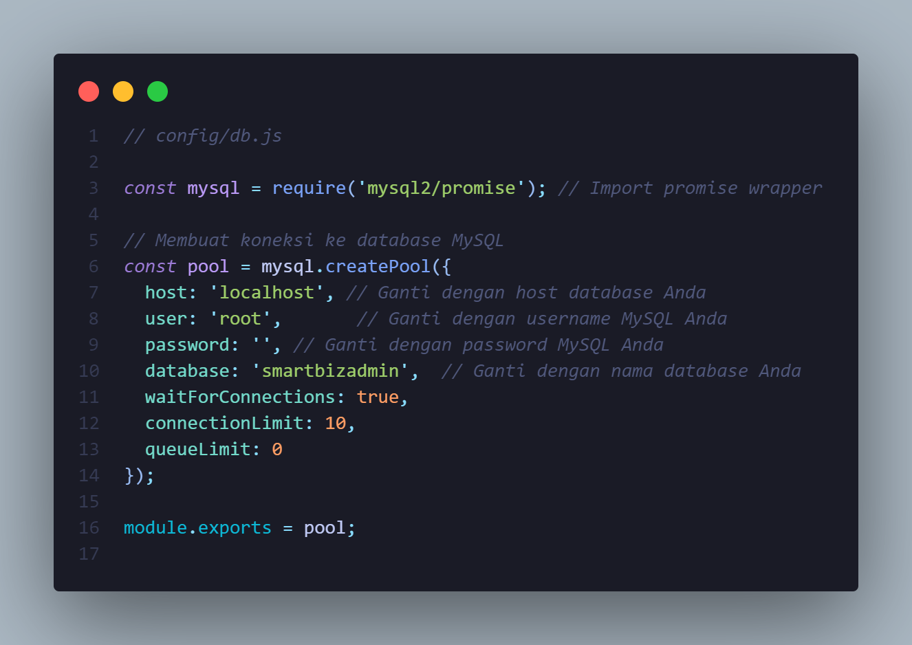
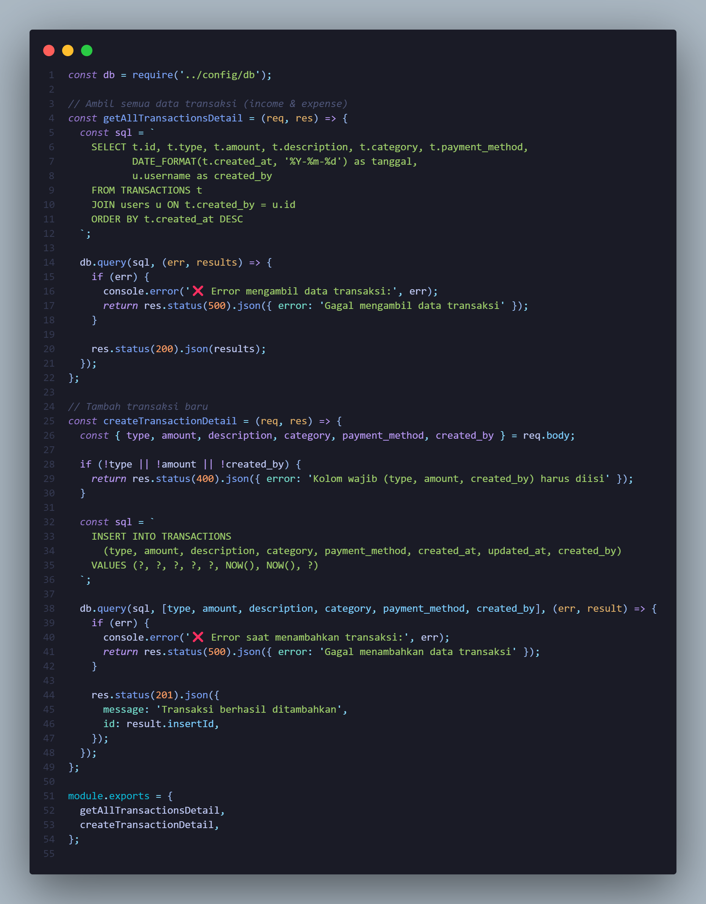
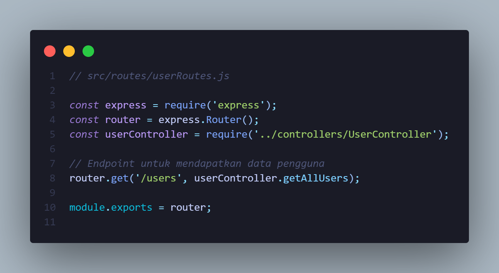
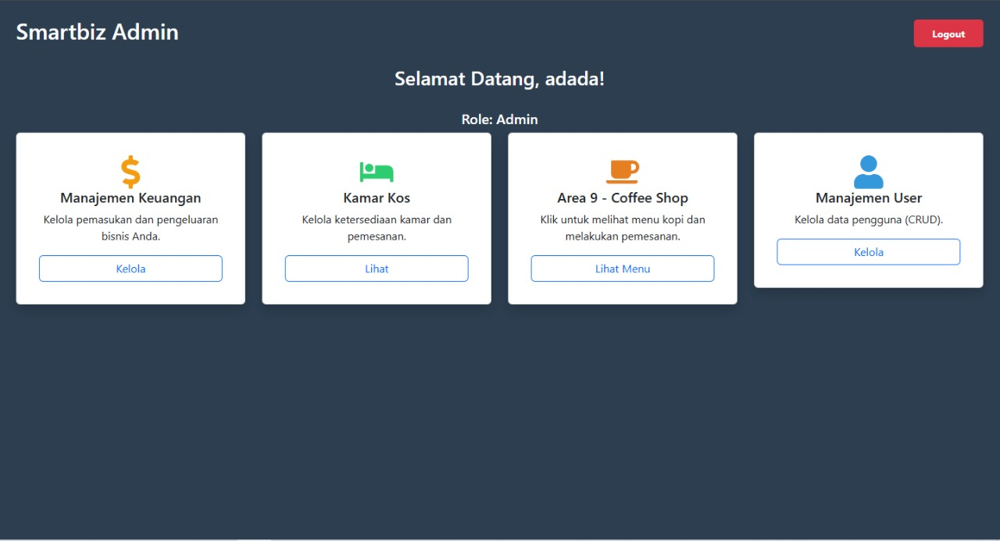
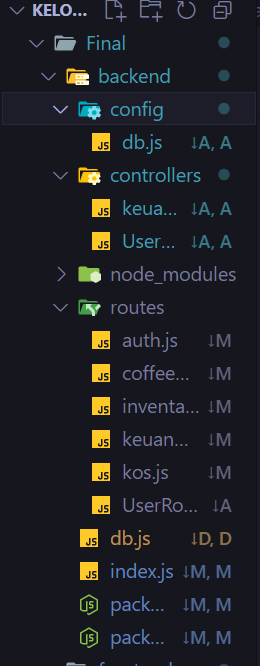

# 🚀 Laporan Progres Mingguan - **SmartBizAdmin**

## 👥 Kelompok: 5
- **Muhammad Fikri Haikal Ariadma / 10231063**  
- **Irfan Zaki Riyanto / 10231045** 
- **Micka Mayulia Utama / 10231053**  
- **Ika Agustin Wulandari / 10231041**  
  
## 🤝 Mitra: Kost Al-Fitri D’Carjoe  
## 📅 Pekan ke-: 11  
## 🗓️ Tanggal:  25/04/2025

---

## ✨ Progress Summary  
Pada pekan ke-11, tim **SmartBizAdmin** telah menyelesaikan sistem autentikasi (login dan register) dengan validasi data dan keamanan dasar. Fitur inti pertama yang sesuai dengan kebutuhan mitra, seperti fitur sistem keuangan dan telah dibangun serta berjalan sesuai fungsinya. Kemudian integrasi antar frontend dan backend juga sudah dilakukan, memastikan data dapat diproses dan ditampilkan dengan baik. Selain itu, tim telah melakukan demo kepada mitra untuk menunjukkan perkembangan, menerima masukan dan mencatat saran perbaikan untuk iterasi berikutnya.

---

## ✅ Accomplished Tasks  
- 🗂️ Implementasi sistem autentikasi (login/register)  
- 🧩 Implementasi fitur inti (user)  
- 🗃️ Integrasi frontend-backend untuk fitur yang sudah ada  
- 🔌 Demo progress ke mitra 

---

## ⚠️ Challenges & 💡 Solutions  

- **🔍 Challenge 1**:  Menjaga keamanan sistem login agar tidak rentan terhadap serangan seperti SQL injection 
  **✅ Solution**: Menggunakan hash password dengan bcrypt serta prepared statements/ORM untuk pengamanan data pengguna.

- **📌 Challenge 2**: Data tidak langsung muncul atau terlambat tampil di frontend setelah dikirim dari backend
  **✅ Solution**: Menambahkan mekanisme loading dan error handling di frontend, serta memperbaiki struktur respon API agar sinkronisasi berjalan lancar

---

## 📅 Next Week Plan  
- 🗺️ Implementasi fitur inti #2 dan #3  
- 🛠️ Penyempurnaan UI/UX  
- 🔌 Pengujian integrasi
- 📽️ Demo progress ke mitra  

---

## 👨‍💻 Contributions  

- **🧑‍🎨 Muhammad Fikri Haikal Ariadma / 10231063**  
  →  Demo progress mitra, Desain halaman, integrasi backend dan frontend

- **🧑‍💻 Irfan Zaki Riyanto / 10230145**  
  → Menyusun struktur backend, Menyusun route, Menghubungkan kode dengan database

- **👩‍🎨 Micka Mayulia Utama / 10231053**  
  →  Membuat laporan MD

- **👩‍💼 Ika Agustin Wulandari / 10231041**  
  →  membuat laporan md

---

## 🖼️ Screenshots / Demo  

### 📎 **Config:**  
 
Gambar diatas menunjukkan konfigurasi khusus untuk model keuangan, yang berisikan pengaturan database, model schema transaksi dan definisi variabel penting yang dibutuhkan untuk menjalankan fitur keuangan (pencatatan transaksi, pemasukkan dan pengeluaran).  

---

### 📎 **Controller Keuangan:**  
  
Gambar diatas menunjukkan penanganan logika bisnis dari fitur keuangan.

---

---

### 📎 **Controller User:**  
  
Gambar diatas menunjukkan penanganan logika bisnis dari fitur user. Untuk memanajemen user

---

### 📎 **auth, coffeeshop, inventaris, keuangan, kos:**  

Gambar diatas adalah keseluruhan fitur utama dari sistem smartbiz admin  
---

### 📎 **user routes:**  
  
Gambar diatas adalah endpoint API yang terhubung ke user controller
---

### 📎 **Halaman Login:**  
  
Gambar diatas adalah halaman untuk autentikasi pengguna dari login

---

---

### 📎 **Halaman Register:**  
  
Gambar diatas adalah halaman untuk autentikasi pengguna dari register

---

### 📎 **Halaman Dashboard Admin:**  
  
   
Gambar diatas adalah tampilan utama setelah login admin. Menampilkan ringkasan data penting menu fitur.

### 📎 **Halaman Manajemen User:**  
  
Fitur ini memungkinkan admin untuk melihat daftar user, mengedit profil user, atau menghapus user dari sistem. Biasanya ada tabel dengan kolom nama, email, role, dan tombol aksi. 

### 📎 **Penambahan Fungsi Logout:**  
  
Logout yang berada dihalam dashboard admin terletak di kanan atas, memungkinkan pengguna keluar dari sesi aktif mereka, menghapus token autentikasi, dan mengarahkan kembali ke halaman login. Ini penting untuk keamanan sistem. 

### 📎 **backend yang baru:**  
  
Menandakan bahwa struktur backend telah diperbarui agar lebih modular dan efisien, memisahkan fitur berdasarkan fungsinya (seperti auth, keuangan, dll), serta menyederhanakan integrasi dengan frontend melalui API yang konsisten.

---

### 📎 **Frontend yang baru:**  
  
Menandakan bahwa struktur frontend telah diperbarui agar lebih modular dan efisien, memisahkan fitur berdasarkan fungsinya (seperti auth, keuangan, dll), serta menyederhanakan integrasi dengan frontend melalui API yang konsisten.

---

### 📎 **Demo Progress ke Mitra:**  
Setelah menghubungi mitra kami melakukan perjanjian untuk bertemu pada Jumat, 25 April 2025 di malam hari .

---