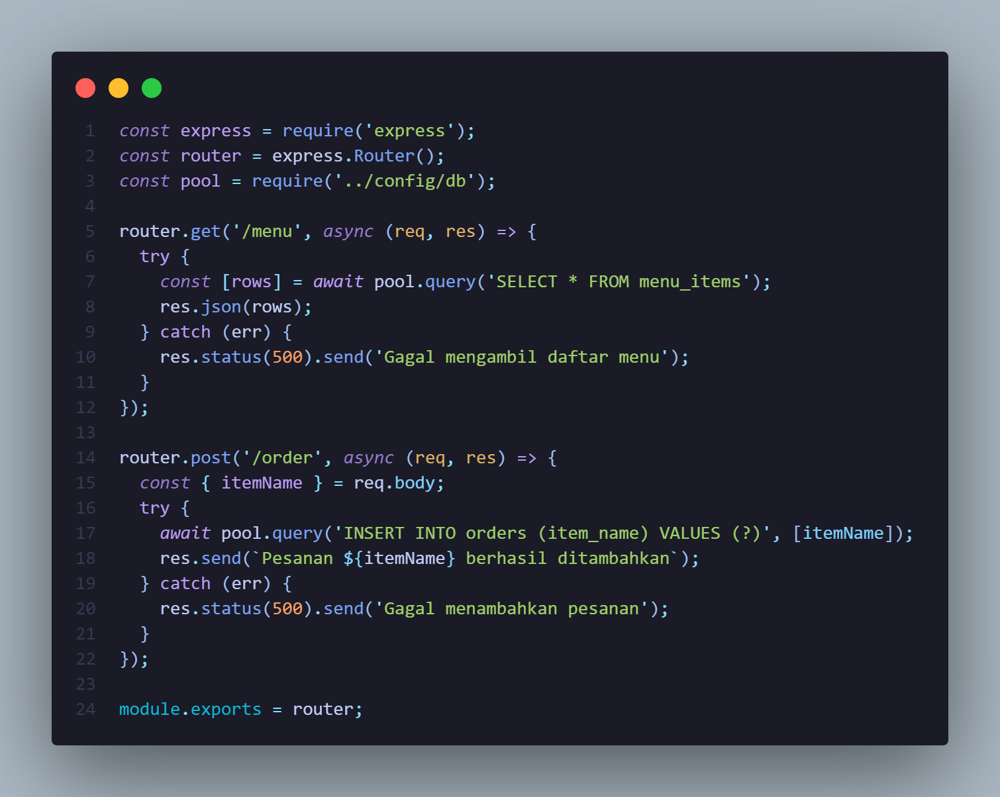
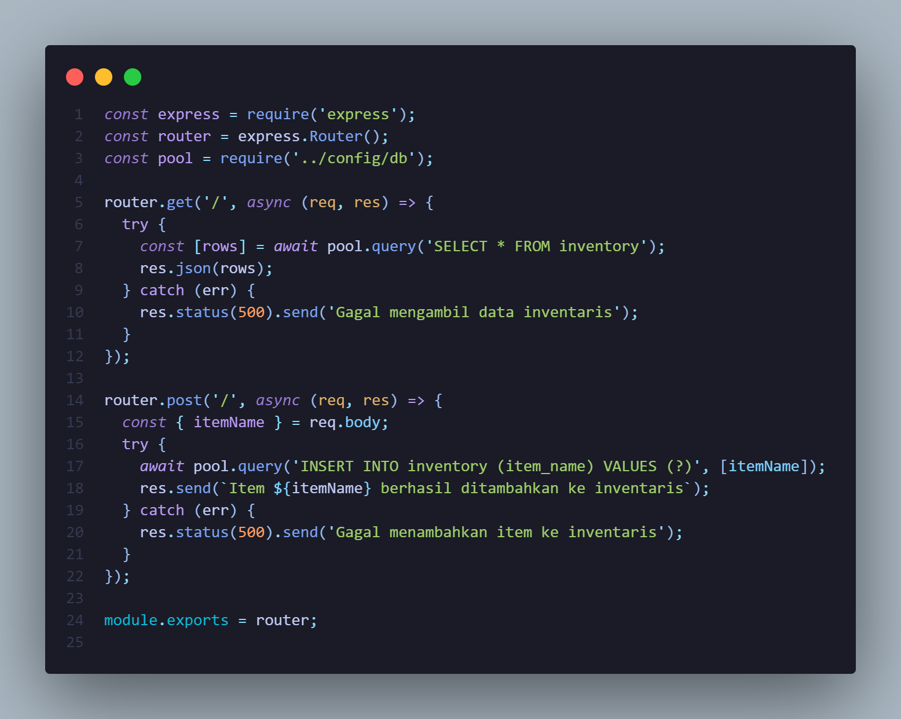
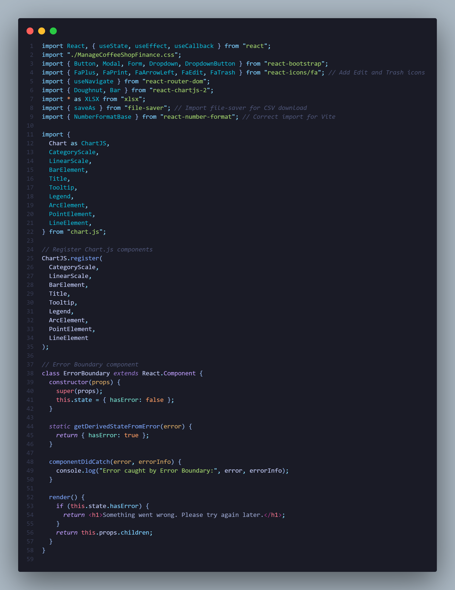
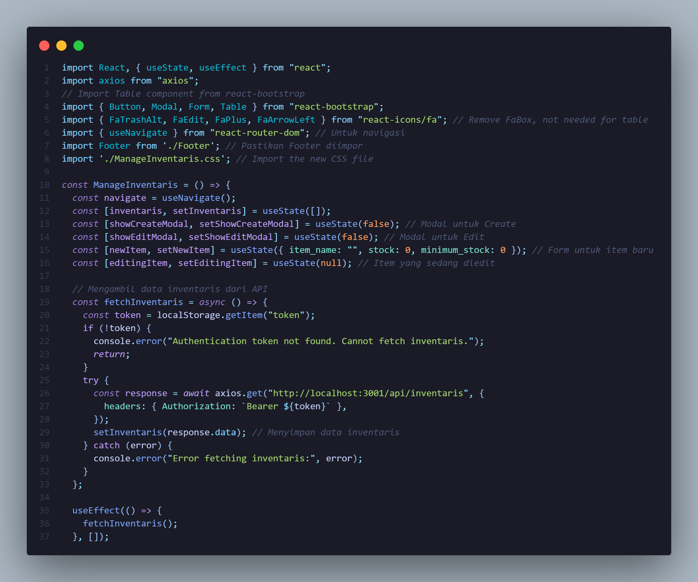
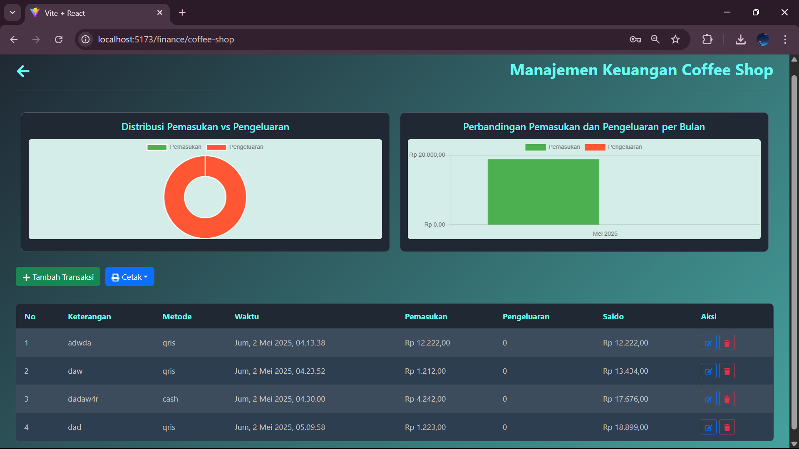
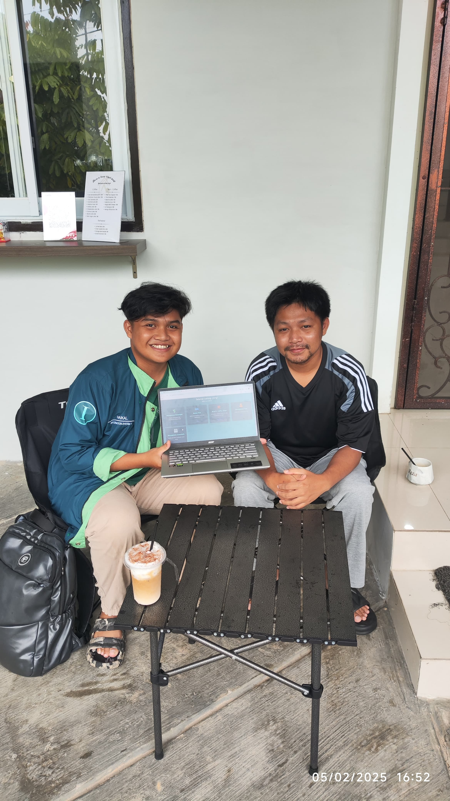
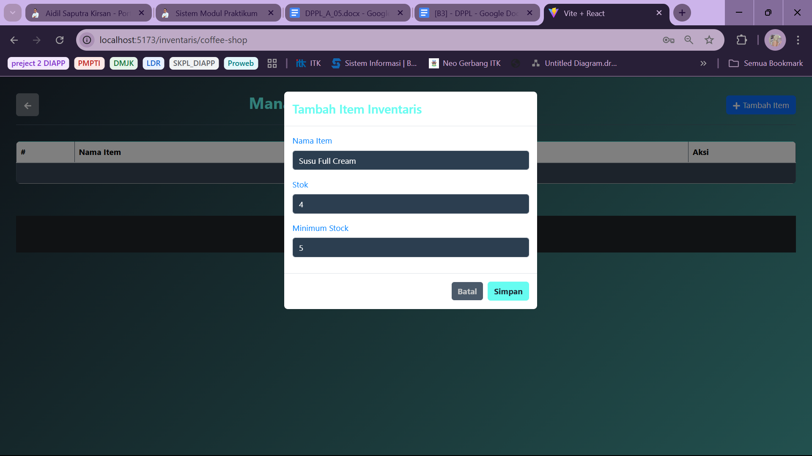
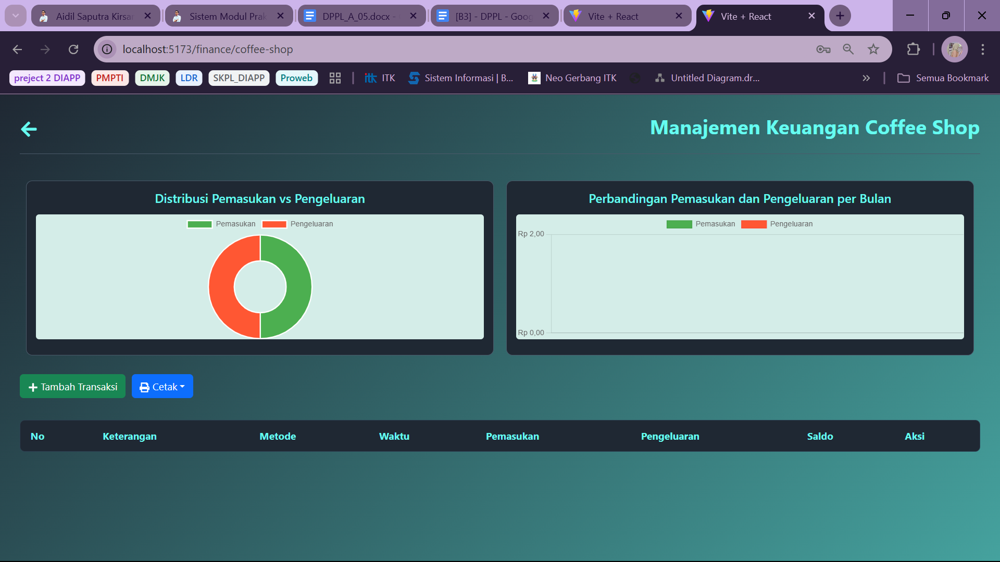
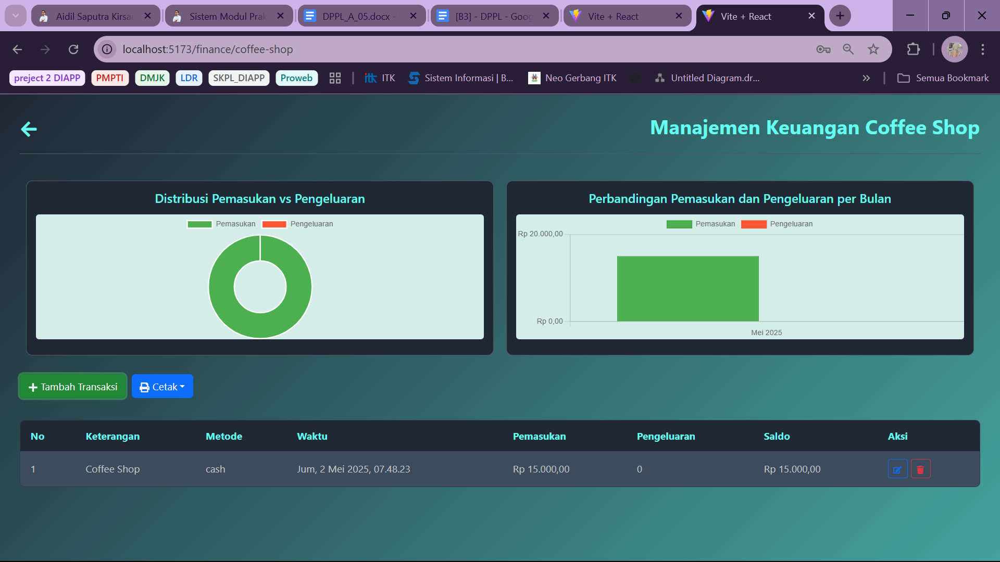
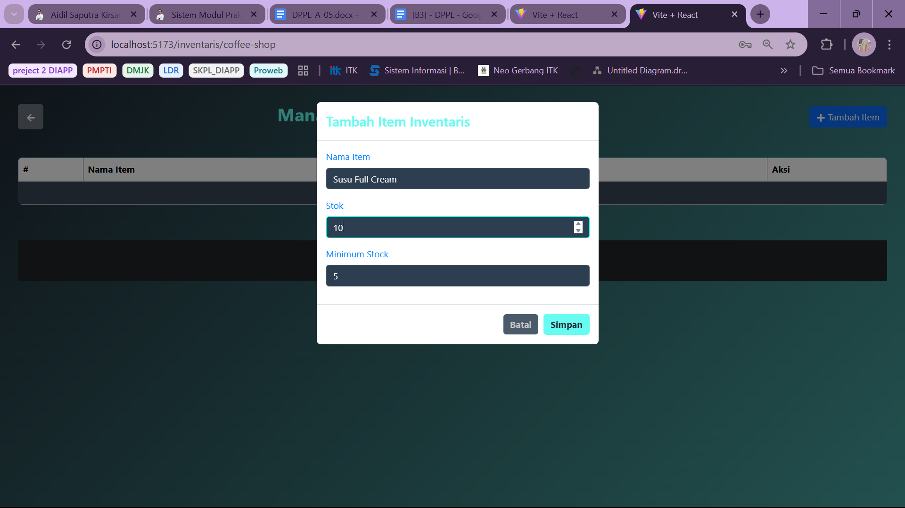

# 🚀 Laporan Progres Mingguan - **SmartBiz Admin**

## 👥 Kelompok: 5
- **Muhammad Fikri Haikal Ariadma / 10231063**  
- **Irfan Zaki Riyanto / 10231045** 
- **Micka Mayulia Utama / 10231053**  
- **Ika Agustin Wulandari / 10231041**  
  
## 🤝 Mitra: Kost Al-Fitri D’Carjoe  
## 📅 Pekan ke-: 12  
## 🗓️ Tanggal:  02/05/2025
---

## ✨ Progress Summary  
- Pada pekan ke-12, tim **SmartBiz Admin** telah menyelesaikan implementasi fitur manajemen inventaris, dan manajemen keuangan yang saling terintegrasi dalam sistem. Selain itu, tim berhasil menambahkan visualisasi data sederhana, yang mencakup visualisasi statistik pemasukan dan pengeluaran pada fitur keuangan. Tim juga telah melakukan pengujian integrasi antar fitur guna memastikan seluruh komponen sistem dapat berfungsi secara sinkron, serta melakukan penyempurnaan pada aspek UI/UX agar tampilan lebih intuitif, responsif, dan nyaman digunakan oleh pengguna.
---

## ✅ Accomplished Tasks  
- 🗂️ Implementasi fitur manajemen inventaris dan manajemen keuangan  
- 🧩 Penyempurnaan UI/UX  
- 🗃️ Pengujian Integrasi  
- 🔌 Demo progress ke mitra 
---

## ⚠️ Challenges & 💡 Solutions  

- **🔍 Challenge 1**: Penambahan data keuangan yang terbaru, tidak langsung otomatis muncul, perlu adanya perefreshan (muat ulang)
- **✅ Solution**: Adanya penambahan pemanggilan ulang (fetch) data dan re-render grafik secara otomatis setelah proses penambahan data berhasil
---

## 📅 Next Week Plan  
- 🗺️ Implementasi fitur Coffee Shop, Kamar Kost 
- 🛠️ Pembuatan admin panel sederhana (dashboard)
- 🔌 Visualisasi data sederhana
- 📽️ Demo progress ke mitra
---

## 👨‍💻 Contributions  

- **🧑‍🎨 Muhammad Fikri Haikal Ariadma / 10231063**  
  → Migrasi Database From MySQL to Postgre, Perbaikan Fitur CRUD pada beberapa fitur menu, Perbaikan UI/UX halaman keseluruhan Website, Pengimplementasian Fitur Print (excel,csv,pdf) pada halaman manajemen keuangan, Pembuatan Dashboard Panel,User Panel,dan beberapa panel lainnya

- **🧑‍💻 Irfan Zaki Riyanto / 10231045**  
  → Perbaikan Halaman Keuangan Kost, Penambahan kolom pada tabel transaction di db, Mengatur perubahan pada halaman sistem manajemen inventaris

- **👩‍🎨 Micka Mayulia Utama / 10231053**  
  → Membuat laporan MD

- **👩‍💼 Ika Agustin Wulandari / 10231041**  
  → Membuat laporan MD
---

## 🖼️ Screenshots / Demo  

### 📎 **Kode Backend:**  

- **Menu Manajemen Keuangan:**  
   
  Kode ini adalah bagian backend dari menu keuangan menggunakan modul `express` untuk membuat server dan menangani permintaan dari frontend, serta `router` untuk mengatur jalur (endpoint) seperti `/menu` dan `/order`. Modul `pool` berasal dari file konfigurasi database dan digunakan untuk menjalankan perintah SQL ke database MySQL. Endpoint `GET /menu` digunakan untuk mengambil daftar semua item menu dari tabel `menu_items`, sedangkan endpoint `POST /order` digunakan untuk menyimpan pesanan baru ke dalam tabel `orders`. Semua proses dibungkus dalam blok `try-catch` untuk menangani error, dan hasilnya dikirim kembali ke pengguna (frontend) sebagai respon JSON atau pesan teks.

- **Menu Inventaris Bisnis:**  
  
  Kode ini adalah backend untuk menu inventaris bisnis menggunakan modul `express` untuk membuat server dan route, serta `mysql2` (melalui `pool`) untuk mengakses database. Route `GET /` digunakan untuk mengambil semua data barang dari tabel `inventory`, sedangkan route `POST /` dipakai untuk menambahkan item baru ke tabel tersebut berdasarkan data dari pengguna. Jika terjadi kesalahan saat akses database, sistem akan menangkapnya dan mengirim pesan error. Semua ini memungkinkan aplikasi menyimpan dan menampilkan data inventaris secara dinamis.
---

### 📎 **Kode Frontend:**  

- **Menu Manajemen Keuangan:**  
   
  Gambar diatas merupakan potongan kode CSS dari komponen react untuk tampilan keuangan, dengan mengimpor berbagai modul pendukung seperti `react-bootstrap` untuk elemen UI (tombol, form, modal), `react-icons` untuk ikon visual, `react-router-dom` untuk navigasi antar halaman, `react-chartjs-2` dan `chart.js` untuk menampilkan grafik batang dan donat, serta `xlsx` dan `file-saver` untuk fitur ekspor data ke file Excel atau CSV. Modul `react-number-format` digunakan untuk memformat angka seperti mata uang, sementara file CSS (`ManageCoffeeShopFinance.css`) mengatur tampilan visual halaman dengan tema gelap dan elemen yang responsif. Selain itu, terdapat komponen `ErrorBoundary` yang berfungsi sebagai penanganan error agar aplikasi tidak crash jika terjadi kesalahan dalam rendering komponen.

- **Menu Inventaris Bisnis:**  
  
  Gambar diatas adalahh potongan kode CSS dari komponen React untuk tampilan inventaris, dengan mengimport berbagai modul pendukung seperti `axios` digunakan untuk melakukan permintaan HTTP ke API backend guna mengambil data inventaris, sedangkan `react-bootstrap` menyediakan komponen UI seperti `Button`, `Modal`, `Form`, dan `Table` untuk membuat tampilan yang responsif dan konsisten. `react-icons/fa` menyuplai ikon-ikon seperti tombol tambah, hapus, edit, dan kembali untuk memperjelas fungsi UI. `react-router-dom` digunakan untuk navigasi halaman melalui `useNavigate`, dan `Footer` adalah komponen khusus yang ditambahkan sebagai elemen bagian bawah halaman. File CSS `ManageInventaris.css` berfungsi untuk mengatur gaya visual halaman. State React (`useState`) digunakan untuk menyimpan data seperti daftar inventaris, status modal, dan data form, sementara `useEffect` menjalankan fungsi pengambilan data saat komponen pertama kali dimuat.
---

### 📎 **Tampilan Sistem Smartbiz Admin:**  

- **Menu Manajemen Keuangan:**  
   
  Gambar diatas adalah tampilan menu manajemen keuangan pada user super admin yang difungsikan untuk melihat data keuangan coffee shop dan kost.

- **Manajemen Keuangan Coffee Shop:**  
   
  Gambar diatas adalah tampilan data keuangan di coffee shop, dimana super admin bisa menambah transaksi, bisa mencetak data keuangan (csv, pdf dan excel), bisa menghapus dan mengedit data keuangan serta adanya tampilan visualisasi data (diagram batang dan lingkaran) 

- **Manajemen Keuangan Kost:**  
   
  Gambar diatas adalah tampilan data keuangan di Kost, dimana super admin bisa menambah transaksi, bisa mencetak data keuangan (csv, pdf dan excel), bisa menghapus dan mengedit data keuangan serta adanya tampilan visualisasi data (diagram batang dan lingkaran)

- **Menu Inventaris Bisnis:**  
  
  Gambar diatas adalah tampilan manajemen inventaris (barang) yang akan menginformasikan pengguna (user) jika stok barang sudah menipis, bisa juga mengedit data barang serta menghapus data barang.

- **Manajemen Inventaris Coffee Shop:**  
   
  Gambar diatas adalah tampilan data inventaris di coffee shop, dimana super admin bisa menambah barang, bisa menghapus dan mengedit data barang

- **Manajemen Inventaris Kost:**  
   
  Gambar diatas adalah tampilan data inventaris di Kost, dimana super admin bisa menambah barang, bisa menghapus dan mengedit data barang.
---

### 📎 **Demo Progress ke Mitra:**  
  
- Bukti progres ke mitra 
---

### 📎 **3 test case fungsi:**  

- **Minimun Stok:**  
  - 
     Tampilan awal saat manajemen invetaris coffee shop belum di input

  - 
    Tampilan ketika menginput data inventaris di bawah stok minimum

  - 
    Tampilan ketika data inputan stok inventaris berada di bawah nilai minimum stok

- **Grafik Pembayaran:**  
  - 
     Tampilan awal saat manajemen keuangan coffee shop belum di input

  - 
     Tampilan ketika ingin menginput data pemasukan
  
  - 
     Tampilan ketika data pemasukan berhasil di inputkan
  
  - 
     Tampilan ketika ingin menginput data pengeluaran
  
  -  
     Tampilan ketika data pemasukan dan pengeluaran berhasil di input, maka grafik batang dan lingkaran akan langsung menampilkan perbandingan antara pemasukan dan pengeluaran

- **Stok Saat Tidak di nilai Minimum:**  
  - 
    Tampilan awal saat manajemen invetaris coffee shop belum di input 

  - 
     Tampilan ketika menginput data inventaris tidak di bawah stok minimum

  - 
     Tampilan ketika data inputan stok inventaris tidak di bawah nilai minimum stok
---